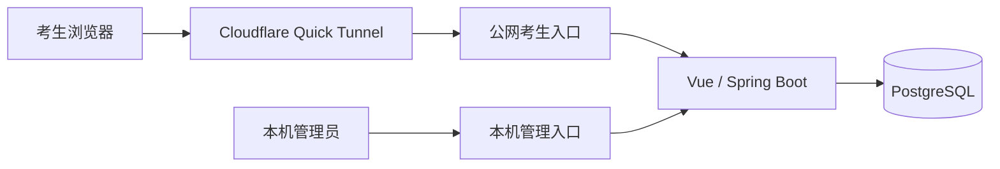

<div align="center">

<p><strong>2026 · 黑龙江 · 普通本科批</strong></p>

# 高考志愿投档模拟系统

从考生数据、志愿版本到投档快照，让每一次模拟都有据可查。

<p>
  
  
  
  
  
</p>

**[本地启动](#quick-start) · [使用流程](#workflow) · [Excel 导入导出](#excel) · [投档规则](#rules) · [开发进度](#roadmap)**

[项目交接](handoff.md) · [配置示例](.env.example) · [构建与验证](#verification)

</div>

---

> **当前阶段：P1-2 已完成，下一阶段为 P1-3。**
> 已接通数据导入、志愿填报、手动保存、正式提交、版本打印和投档查询。管理员工作台、体验重置保护与在线统计已可用；应用容器化、公网入口和启停备份仍待完成。
>
> 本系统仅用于模拟和体验，不代表黑龙江省招生考试院或高校的正式投档、录取结果。

<a id="overview"></a>

## 项目概览

项目面向黑龙江省 2026 年普通本科批，目标是复现省级平行志愿投档流程。业务主体只有**后台管理员**和**考生**。

| 45 个专业组 | 每组 6 个专业 | 12 种选科组合 | 2 类投档队列 |
| :---: | :---: | :---: | :---: |
| 平行志愿模型上限 | 保留专业顺序与调剂标志 | 首选物理或历史，再选任选两门 | 物理类、历史类分别排序 |

上述约束已贯通数据库、后端服务和新版页面。草稿与正式提交分开保存，投档仅使用截止前最后一次有效提交。

| 角色 | 主要职责 |
| :--- | :--- |
| 管理员 | 导入考生与招生计划、配置批次、执行投档、查询审计、导出结果 |
| 考生 | 登录与改密、填报及提交志愿、查看本人结果、导出本人志愿表 |

**范围说明：** 只模拟省级投档到院校专业组，不模拟高校内部专业录取。暂不支持提前批、艺术类、体育类、专项计划和征集志愿。教师主体、自助注册、智能推荐及课程分配已退出当前业务入口；旧原型代码和数据表暂时保留，待后续备份并核对依赖后清理。

## 当前能力

| 模块 | 已实现 | 当前边界 |
| :--- | :--- | :--- |
| 数据库 | PostgreSQL 16、Flyway V1–V6、约束与不可变快照 | 旧原型表暂时保留，H2 已移除 |
| 志愿填报 | 45 个专业组、每组 6 个专业、顺序调整、调剂标志、选科提示 | 手动保存不等于正式提交，截止后不能再保存或提交 |
| 提交与打印 | 截止前重提、修订冲突保护、幂等请求、版本查看、A4 横向打印 | 考生查看有效版本，管理员审计全部历史版本 |
| 投档引擎 | 分科队列、完整同分键、控制线、选科过滤、一次投档 | 管理员截止后执行；每次创建新快照，不覆盖旧结果 |
| 管理工作台 | 填报时间、分科控制线、计划与比例、账号启停、投档运行、操作审计 | 管理操作仅允许本机管理员访问 |
| 账号安全 | BCrypt、JWT、服务端会话、失败锁定、首次改密、禁用撤销 | 管理员仅限本机访问，反向代理隔离待完成 |
| Excel | 版本化模板、文件选择、事务导入、错误报告、志愿与结果导出 | 只读写新版领域数据 |
| 体验数据 | 10 名虚构考生及配套计划、DEMO 重置、正式来源保护 | 只删除明确标记的体验记录，混合正式数据的运行禁止重置 |
| 在线统计 | 每 10 秒心跳、30 秒超时，包含首次改密页面 | 不延长登录有效期；Stop App 尚未接入 |
| 页面与部署 | 新版管理端、考生端、手机布局；本机 Java / Vite 可运行 | 完整容器化、公网隔离和新版桌面启停待完成 |

最近一次完整验证：**2026-09-06，108 项后端测试通过，后端打包、前端构建及真实浏览器全流程通过。** 详细验证范围见[构建与验证](#verification)。

<a id="quick-start"></a>

## 本地启动

当前 PostgreSQL 使用 Docker Compose；后端和前端在本机运行。以下命令均从项目根目录开始执行。

### 1. 准备环境

| 工具 | 要求 |
| :--- | :--- |
| Java | JDK 17 或更高版本 |
| Maven | 3.8 或更高版本 |
| Node.js / npm | Node.js 18+、npm 9+ |
| Docker Desktop | 已启动；数据库和后端集成测试需要 |

### 2. 设置账号与连接信息

配置项参考 [.env.example](.env.example)。管理员首次初始化需同时提供用户名和密码：

| 配置项 | 用途 |
| :--- | :--- |
| `GAOKAO_ADMIN_USERNAME` | 首次创建的管理员用户名 |
| `GAOKAO_ADMIN_PASSWORD` | 管理员初始密码，12–72 位，包含大小写字母、数字和特殊字符 |
| `GAOKAO_JWT_SECRET` | 至少 32 字节的随机签名密钥 |
| `GAOKAO_APP_MODE` | `DEMO` 为体验模式；未配置时后端默认 `PRODUCTION`，禁止体验重置 |
| `GAOKAO_NOTICE_VERSION` | 模拟用途声明版本，默认 `2026-1`；更新后考生需重新确认 |
| `GAOKAO_DEMO_DATA_ENABLED` | 旧原型数据初始化开关，保持 `false`；新版体验数据通过 Excel 导入 |
| `GAOKAO_DB_NAME` | Compose 首次初始化的数据库名称，默认 `gaokao` |
| `GAOKAO_DB_USERNAME` / `GAOKAO_DB_PASSWORD` | PostgreSQL 用户名与密码 |
| `GAOKAO_DB_PORT` | Compose 绑定的本机数据库端口，默认 `15432` |
| `GAOKAO_DB_URL` | 后端数据库地址，默认 `jdbc:postgresql://localhost:15432/gaokao` |
| `GAOKAO_ALLOWED_ORIGINS` | 允许的前端来源，例如 `http://localhost:5173` |

> **当前配置方式**
> Docker Compose 会读取根目录 `.env`，但当前本地后端启动脚本**尚不会读取该文件**。后端使用的账号、密钥和数据库配置需设置为 Windows 用户环境变量或启动进程环境变量；数据库连接信息应与 Compose 保持一致。
>
> Windows 设置入口：搜索“编辑系统环境变量” → “环境变量” → “用户变量” → “新建”。设置后需重新打开启动程序并重启后端。

管理员账号已存在时，改变初始化配置不会重置其密码，应登录后使用“修改密码”。未设置 JWT 密钥时，后端会临时生成密钥，重启后已有登录失效；公网体验应配置固定随机密钥。

**体验导入前先确认模式：** 在后端启动环境设置 `GAOKAO_APP_MODE=DEMO`，重启后确认管理工作台显示“体验模式”，再导入虚构数据。只修改 `.env` 不会改变当前本地后端的模式。`PRODUCTION` 是数据保护模式，不代表公网部署已经完成。

### 3. 启动数据库

```powershell
docker compose up -d postgres
docker compose ps
```

PostgreSQL 默认仅监听 `127.0.0.1:15432`，数据存放于 `data/postgres/`。后端首次连接空库时会自动执行 Flyway 迁移；调整数据库名称或端口时，同步设置后端的 `GAOKAO_DB_URL`。

首次连接前确认 `docker compose ps` 中数据库状态为 `healthy`。已有数据目录不会因为修改初始化环境变量而自动重设数据库账号密码；不要通过删除 `data/postgres/` 解决连接问题。

### 4. 启动应用

首次使用先安装前端依赖并构建后端：

```powershell
npm --prefix frontend install
mvn -f .\backend\pom.xml -DskipTests package
```

随后启动后端和前端：

```powershell
powershell.exe -NoProfile -ExecutionPolicy Bypass -File .\scripts\start-backend.ps1
powershell.exe -NoProfile -ExecutionPolicy Bypass -File .\scripts\start-frontend.ps1
```

| 入口 | 地址或位置 |
| :--- | :--- |
| 应用首页 | [http://localhost:5173](http://localhost:5173) |
| 管理工作台 | [http://localhost:5173/admin](http://localhost:5173/admin) |
| 考生填报 | [http://localhost:5173/application](http://localhost:5173/application) |
| 本人投档结果 | [http://localhost:5173/results](http://localhost:5173/results) |
| Excel 管理页面 | [http://localhost:5173/excel](http://localhost:5173/excel) |
| 后端 | `http://localhost:8080` |
| 数据库 | `127.0.0.1:15432` |
| 后端日志 | `logs/backend.log` |

登录后会按角色进入管理工作台或考生填报页。更新后端代码后需重新打包并重启；现有脚本会复用已存在的 JAR，不会自动检测源码变化。Windows 下重新打包前应停止占用该 JAR 的后端进程。

<details>
<summary><strong>桌面快捷方式与启停边界</strong></summary>

现有快捷方式创建脚本仍指向旧 `start-app-session.ps1`：关闭独立窗口会停止服务。这不适用于多人体验，因此当前推荐使用上面的独立后端、前端脚本启动，不把旧快捷方式作为新版入口。

P1-3 将统一重写 Start App、Stop App 和快捷方式：点击启动、停止前查询在线人数并备份，不恢复开机自启动，也不再因考生关闭页面而停止整个系统。

</details>

<a id="workflow"></a>

## 使用流程

### 管理员准备

1. **导入基础数据。** 在“数据导入导出”创建批次，导入考生与成绩、院校专业组与计划。
2. **开放填报。** 在“管理工作台 → 填报设置”配置开始时间、截止时间、物理类与历史类控制线，并保存。
3. **核对计划。** 在“招生计划”检查人数、选科要求和投档比例；人数及比例可以单独保存，其他基础数据使用 Excel 维护。
4. **查看提交。** 在“考生与版本”查询历史正式志愿，也可启用或禁用账号；禁用后会话立即撤销。
5. **截止后投档。** 在“投档运行”创建新运行，查看结果与检索轨迹，并按需导出。重复执行保留旧运行。

新版填报日期与控制线以管理员工作台中的批次配置为准，不使用旧 `gaokao.application-window` 配置。空库和体验模板不会自动开放填报。

### 考生填报

1. **登录并确认。** 使用管理员分配的准考证号账号；首次登录修改初始密码，重新登录后确认模拟用途声明。
2. **核对信息。** 查看本人姓名、科类、选科、分科成绩和位次；发现问题联系管理员，不自行修改成绩。
3. **编辑志愿。** 按顺序选择同科类院校专业组，每组填写最多 6 个专业并选择是否服从组内调剂。
4. **保存草稿。** 点击“保存草稿”后写入数据库；不自动保存。选科不匹配可以暂存，但必须修改后才能正式提交。
5. **正式提交。** 核对已保存内容后点击“正式提交”。每组至少选择一个有效专业，截止前可以再次保存和提交。

> **保存草稿 ≠ 正式提交。**
> 只有正式提交才进入投档；未保存内容在关闭或刷新后可能丢失。页面会在离开前警告，有修订冲突时通过“刷新填报数据”重新核对。

### 查看与留存

| 入口 | 可查看内容 |
| :--- | :--- |
| 志愿填报 → 查看正式版本 | 截止前最后一个有效提交版本，支持 A4 横向打印 |
| 正式志愿表 | 本人正式志愿 Excel 下载；草稿不能作为正式志愿导出 |
| 投档结果 | 本人在最新完成运行中的投档状态、院校专业组及检索过程 |

管理员调整截止时间后，系统重新按截止时间选择生效版本，但不会删除历史提交。手机结果页直接展示投档状态与院校专业组，检索轨迹纵向排列。

<a id="excel"></a>

## Excel 导入导出

管理员登录后打开侧栏 **数据导入导出**，即可下载模板、选择电脑中的 Excel 文件并提交整批导入。

| 考生与成绩 | 院校专业组与计划 |
| :--- | :--- |
| 准考证号、姓名、身份证信息、科类与选科 | 院校、专业组、组内专业与选科要求 |
| 六科成绩、政策加分、文化课总分、最终位次 | 招生人数、投档比例与限制说明 |
| 新账号首次登录必须改密 | 专业组与专业跨工作表校验 |

### 导入流程

1. **选择批次。** 空库可点击“创建2026普通本科批”，仅建立省份、年度和批次，不自动设置控制线或填报时间。
2. **下载模板。** 选择“考生与成绩”或“院校专业组与计划”，下载空白模板或体验数据。
3. **选择文件。** 支持 `.xlsx` 和 `.xls`，单文件上限 **2MB**，每张业务表最多 **1000 行**。
4. **整批导入。** 任意一行错误都会导致整批拒绝，页面显示原 Excel 行号、字段及原因，并提供错误报告下载。
5. **查看记录。** 成功记录显示新增和更新数量；失败记录可以再次下载错误报告。

<details>
<summary><strong>查看模板字段与填写约定</strong></summary>

| 工作表 | 填写要求 |
| :--- | :--- |
| 模板信息 | 包含类型、版本 `1.0`、年份、地区和批次；请保留原始内容与表头 |
| 考生 | 文化课总分等于六科之和，不含政策加分；两门再选科目不得重复 |
| 专业组 | 省份使用“黑龙江”等简称；投档比例填写 `1.00` 至 `1.05`；必选再选科目用逗号分隔，留空代表不限 |
| 专业 | 通过院校代码和专业组代码关联；同组专业代码与显示顺序不得重复 |

准考证号和身份证号应使用文本格式。代码允许字母、数字、下划线和连字符，不接受公式单元格。两门再选科目的填写顺序可以交换，入库时成绩会与科目同步归一化。

</details>

<details>
<summary><strong>查看重复导入与历史数据保护规则</strong></summary>

- 同一文件内重复准考证号会被拒绝；数据库中已有的账号按覆盖更新处理，并保留原密码。
- 已提交正式志愿的考生，成绩、位次和选科不得变更；违反时整批回滚。
- 同一院校专业组按更新处理；组内未再次提供的专业停用，保留已有草稿引用。
- 已被正式志愿引用的专业组禁止覆盖，相关院校名称和省份同样受到历史引用保护。
- 原始身份证信息仅在导入过程中临时用于生成密码哈希，不长期保存上传原表；错误报告不包含完整身份证或密码。

</details>

### 体验数据

已生成文件位于本机 `data/imports/`，页面也提供下载入口：

| 文件 | 内容 |
| :--- | :--- |
| `demo-candidates-v1.xlsx` | 物理类 5 人、历史类 5 人，覆盖高分、同分、控制线附近与线下样本 |
| `demo-plans-v1.xlsx` | 配套虚构院校、专业组和招生计划 |
| `template-candidates-v1.xlsx` | 空白考生与成绩模板 |
| `template-plans-v1.xlsx` | 空白专业组与计划模板 |

体验样本以**虚构的 450 分控制线**构造，不代表官方控制线，也不会自动写入批次。体验身份证标识以 `000000` 开头，初始密码为表中标识的后六位。

每次重新下载体验表会生成新的随机后六位；重复导入仍保留账号原密码。上述文件含初始凭据信息，仅存放在 Git 忽略的 `data/` 目录。

### 导出内容

| 导出文件 | 内容与权限 |
| :--- | :--- |
| 错误报告 | 工作表、原 Excel 行号、字段与失败原因；管理员下载 |
| 正式志愿表 | 截止前最后一次有效提交，保留 6 个专业槽位与调剂标志；考生仅能导出本人记录 |
| 投档结果 | 运行审计、结果、检索轨迹、控制线快照与计划快照；管理员下载 |

截止前导出的志愿表标注为“当前正式提交”。新版填报页的正式提交已接入导出；旧原型表的数据不会自动转换为新版记录，旧 `student_id` 账号也不能直接作为新版考生使用。

<a id="rules"></a>

## 投档规则

**分数优先、遵循志愿、一次投档。** 物理类和历史类使用独立队列、控制线与计划。

### 同分排序

| 优先级 | 比较项目 |
| :---: | :--- |
| 1 | 文化课成绩与政策性照顾分值之和 |
| 2 | 语文与数学成绩之和 |
| 3 | 语文或数学单科最高成绩 |
| 4 | 外语成绩 |
| 5 | 首选科目成绩 |
| 6 | 再选科目单科最高成绩 |
| 7 | 再选科目单科次高成绩 |
| 8 | 志愿顺序；同一顺序仍同分者全部投档，允许超过计划数 |

### 检索与结果

- 依次检索最多 45 个院校专业组志愿，校验控制线、科类及选科要求。
- 专业组投档比例默认 100%，可在 100%–105% 范围内配置。
- 一旦投档成功，本批次停止检索后续志愿；高校后续退档不再继续检索。
- 体检、色觉、语种及单科成绩等专业限制仅作风险提示，不参与省级投档计算。

| 已投档 | 未投档 / 滑档 | 未达控制线 | 无有效志愿 |
| :---: | :---: | :---: | :---: |
| 命中一个院校专业组 | 有有效志愿但未能投档 | 未达到本科控制线 | 截止前无有效正式志愿 |

投档比例换算人数目前采用向下取整；末位同分规则仍可能使最终人数突破基础名额。取整口径需在取得更细技术规则后继续核对。

<details>
<summary><strong>查看新投档引擎管理接口</strong></summary>

| 方法 | 接口 | 用途 |
| :--- | :--- | :--- |
| `POST` | `/api/admission-runs?batchId={batchId}` | 为已截止批次创建新投档运行 |
| `GET` | `/api/admission-runs/{runId}/results` | 查询该次运行的不可变结果 |
| `GET` | `/api/admission-runs/{runId}/candidates/{candidateId}/traces` | 查询考生逐志愿检索轨迹 |

</details>

规则参考：[黑龙江省 2026 年普通高等学校招生工作规定](https://gaokao.chsi.com.cn/gkxx/zc/ss/202604/20260429/2293463207-11.html) · [黑龙江省政府相关招生信息](https://www.hlj.gov.cn/hljapp/c116058/202604/c00_31936434.shtml)

<a id="security"></a>

## 账号与数据

### 已实现的账号保护

| 机制 | 行为 |
| :--- | :--- |
| 账号来源 | 管理员 Excel 导入，用户名为 10 位准考证号，不开放自助注册 |
| 密码存储 | BCrypt；身份证后六位仅用于生成初始密码，长期只保留脱敏身份 |
| 首次登录 | 考生必须改密；管理员不强制首次改密 |
| 登录会话 | JWT 与 PostgreSQL 服务端会话同时有效，2 小时过期，单设备登录 |
| 登录失败 | 连续失败 5 次锁定 15 分钟 |
| 会话撤销 | 改密、账号禁用或新设备登录会使旧会话失效 |
| 管理权限 | 登录及每次管理请求校验本机地址、转发来源与 Host |

### 版本与审计

新版数据库支持不可覆盖的志愿提交版本和投档快照。每次投档保存考生、成绩、生效志愿、计划、控制线、比例与检索轨迹，新运行不会覆盖旧结果。

志愿草稿使用修订号防止其他页面覆盖；正式提交使用请求 UUID 处理网络重试，成功重试不会重复创建版本。批次时间、控制线、计划人数、比例、投档运行和体验重置都有操作审计。模拟用途声明按版本与确认时间保存。

| 迁移版本 | 职责 |
| :--- | :--- |
| V1 | 旧原型基线，暂时保留历史表与数据 |
| V2 | 新版领域模型、唯一约束和不可变结构 |
| V3 | 无正式志愿考生的投档快照支持 |
| V4 | 安全账号与服务端会话 |
| V5 | 新版考生账号关联与 Excel 导入审计 |
| V6 | 志愿工作流、批次修订、声明确认、体验来源、在线心跳与操作审计 |

### 体验重置与正式数据保护

| 运行模式 | 重置行为 |
| :--- | :--- |
| `DEMO` | 本机工作台显示“彻底删除体验数据”；两次确认并输入“删除体验数据”后执行 |
| `PRODUCTION` | 页面不显示重置入口，后端同样拒绝重置请求 |

- 重置删除明确标记的体验账号、会话、草稿、正式志愿及纯体验投档运行；保留管理员、招生计划、批次配置、审计和正式考生。
- 新考生按创建时的运行模式确定来源。覆盖导入、切换模式都不会重写已有来源，V6 以前的存量考生默认受到正式数据保护。
- 同一次运行包含正式考生时，拒绝整体重置；不能仅凭姓名、准考证号或文件名判断数据属于体验用途。
- 体验环境只使用虚构信息；真实身份证、准考证号和成绩不得用于短期公网体验。数据库、体验表、凭据和备份不得提交到 Git。

**备份仍待实现：** P1-3 计划在正常停止前备份至 `data/backups/`，保留最近 30 份，并加入备份失败保护。当前不能把“已有数据库持久化”当作“已有自动备份”。日志轮转和正式数据归档等运行保障继续按交接文档落实。

<a id="architecture"></a>

## 技术架构

| 层级 | 技术 |
| :--- | :--- |
| 前端 | Vue 3 · Vite · Pinia · Vue Router · Element Plus · Axios；旧原型仍保留 ECharts 依赖 |
| 后端 | Java 17+ · Spring Boot 3.3.6 · JdbcTemplate · MyBatis · Bean Validation |
| 数据库 | PostgreSQL 16 · Flyway |
| 数据处理 | Apache POI · EasyExcel |
| 集成测试 | Testcontainers PostgreSQL · MockMvc |
| 当前运行 | Docker Compose 数据库 + 本地 Java / Vite |

### 公网体验部署目标

下面是后续部署方案，当前尚未完成公网入口与应用容器化。



基于现有 Windows 电脑、Docker Desktop 与 WSL2 Ubuntu，面向约 10 人短期体验。采用随机 HTTPS 地址，预留未来正式域名；数据库不向公网开放。体验期间电脑需保持开机、联网并关闭自动休眠。

| 目标流程 | 主要步骤 |
| :--- | :--- |
| Start App | 启动 Docker → 启动项目 → 建立隧道 → 打开本机后台 → 显示公网网址 |
| Stop App | 检查在线人数 → 二次确认 → 停止隧道 → 备份数据库 → 停止项目并退出 Docker |

在线统计已实现每 10 秒心跳、30 秒超时；`GET /api/admin/workflow/online` 要求本机管理员认证，独立 Stop App 尚未接入。关闭浏览器触发全局停止的旧启动脚本仍待替换。

公网代理需要按考生功能配置白名单，不能整段放行 `/api/excel/**`，也不能放行 `/api/admin/**` 或 `/api/admission-runs/**`。在 P1-3 完成前，不将当前 Vite 开发服务作为正式公网入口。

<details>
<summary><strong>查看目录结构</strong></summary>

```text
demo_HUAWEI/
├── backend/            Spring Boot 后端、迁移与测试
│   └── src/main/
│       ├── java/       账号、投档、Excel 与 workflow 模块
│       └── resources/  应用配置与 Flyway 迁移
├── frontend/           Vue 管理端与考生端
├── scripts/            Windows 启停与快捷方式脚本
├── data/               数据库、体验表与备份，不进入 Git
├── user-guides/        本机用户说明，不进入 Git
├── compose.yaml        PostgreSQL 开发环境
├── .env.example        配置项示例
├── README.md           项目入口
└── handoff.md          已确认需求与后续交接
```

</details>

<a id="verification"></a>

## 构建与验证

### 最近验证记录

以下为 **2026-09-06** 的本地验证记录，不代表持续集成的实时状态。

| 检查 | 结果 |
| :--- | :--- |
| 后端自动化测试 | **108 项通过**，含 14 项 Excel 与 23 项新版工作流集成测试 |
| 后端打包 | 通过 |
| 前端生产构建 | 通过；存在既有的大分包提示 |
| 数据库迁移 | 空库迁移至 V6；已有开发库升级与重复启动校验通过 |
| 志愿边界 | 45 个专业组、270 个专业位置、跨科类与跨组校验通过 |
| 版本与并发 | 并发保存冲突、提交幂等、截止调整和历史版本保护通过 |
| 浏览器流程 | 真实导入、首次改密、声明、保存、离开提醒、两次提交、历史版本、投档查询及重置通过 |
| 打印与布局 | A4 横向 PDF、1440px 桌面和 390px 手机视口验证通过 |

P1-2 的 Playwright 全流程使用独立 PostgreSQL 体验库，没有重置已有开发数据库；早期 Excel 页面夹具测试仍保留为补充。事务回滚、权限、在线状态和 DEMO / PRODUCTION 保护由 PostgreSQL + MockMvc 集成测试验证。

### 执行命令

先启动 Docker Desktop，测试会自动创建独立的 PostgreSQL 测试容器。

```powershell
# 后端测试和打包
cd backend
mvn test
mvn -DskipTests package

# 前端构建
cd ..\frontend
npm run build
```

如果本机 Maven 尚未加入 PATH，当前开发电脑可使用 `D:\maven\apache-maven-3.9.16\bin\mvn.cmd` 替换 `mvn`。

<a id="roadmap"></a>

## 开发进度

| 阶段 | 内容 | 状态 |
| :--- | :--- | :--- |
| P0-1 | 基线、PostgreSQL、Flyway、Testcontainers | 已完成 |
| P0-2 | 考生、专业组、志愿版本与快照领域模型 | 已完成 |
| P0-3 | 黑龙江普通本科批省级投档引擎 | 已完成 |
| P0-4 | 账号、安全与权限 | 已完成 |
| P1-1 | Excel 导入导出与 10 人体验数据 | 已完成 |
| P1-2 | 新版志愿编辑、提交、管理流程、体验保护与在线状态 | 已完成 |
| **P1-3** | **应用 Docker 化、公网隔离、Quick Tunnel、启停与备份** | **下一阶段** |

下一阶段先完成前后端镜像、Compose 健康检查和公网代理白名单，再接入 Quick Tunnel、环境变量注入及独立启停备份，并验证 10 人并发、重启恢复和断网恢复。旧原型表与服务需在备份、依赖核对后另行清理，不能直接删除已有数据。

详细范围、验收要求和实现记录见 [handoff.md](handoff.md)。

---

<div align="center">

**数据可追溯 · 规则可验证 · 结果可解释**

[返回顶部](#高考志愿投档模拟系统)

</div>
