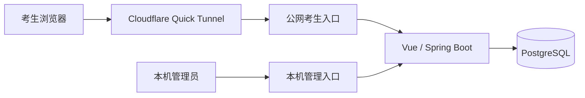

<div align="center">

<p><strong>2026 · 黑龙江 · 普通本科批</strong></p>

# 高考志愿投档模拟系统

从考生数据、志愿版本到投档快照，让每一次模拟都有据可查。

<p>
  
  
  
  
  
</p>

**[本地启动](#quick-start) · [Excel 导入导出](#excel) · [投档规则](#rules) · [开发进度](#roadmap)**

[项目交接](handoff.md) · [配置示例](.env.example) · [构建与验证](#verification)

</div>

---

> **当前阶段：P1-1 已完成，下一阶段为 P1-2。**
> 数据库、投档引擎、账号安全和 Excel 导入导出已实现。新版志愿编辑与提交服务仍在迁移，现有旧版页面尚未完整接入新模型。
>
> 本系统仅用于模拟和体验，不代表黑龙江省招生考试院或高校的正式投档、录取结果。

<a id="overview"></a>

## 项目概览

项目面向黑龙江省 2026 年普通本科批，目标是复现省级平行志愿投档流程。业务主体只有**后台管理员**和**考生**。

| 45 个专业组 | 每组 6 个专业 | 12 种选科组合 | 2 类投档队列 |
| :---: | :---: | :---: | :---: |
| 平行志愿模型上限 | 保留专业顺序与调剂标志 | 首选物理或历史，再选任选两门 | 物理类、历史类分别排序 |

上述约束已进入新版领域模型；45 志愿的完整页面流程尚待 P1-2 接通。

| 角色 | 主要职责 |
| :--- | :--- |
| 管理员 | 导入考生与招生计划、配置批次、执行投档、查询审计、导出结果 |
| 考生 | 登录与改密、填报及提交志愿、查看本人结果、导出本人志愿表 |

**范围说明：** 只模拟省级投档到院校专业组，不模拟高校内部专业录取。暂不支持提前批、艺术类、体育类、专项计划和征集志愿。教师主体、自助注册、智能推荐及课程分配不属于目标产品范围。

## 当前能力

| 模块 | 已实现 | 当前边界 |
| :--- | :--- | :--- |
| 数据库 | PostgreSQL 16、Flyway V1–V5、约束与不可变快照 | 旧原型表暂时保留，H2 已移除 |
| 投档引擎 | 分科队列、完整同分键、控制线、选科过滤、一次投档 | 新引擎已提供管理接口，旧页面待迁移 |
| 账号安全 | BCrypt、JWT、服务端会话、失败锁定、首次改密、禁用撤销 | 管理员仅限本机访问，反向代理隔离待完成 |
| Excel | 版本化模板、文件选择、事务导入、错误报告、志愿与结果导出 | 只读写新版领域数据 |
| 体验数据 | 10 名虚构考生及配套院校计划，支持下载后导入 | 体验重置与正式数据保护待完成 |
| 前端与启动 | Vue 管理端及考生端原型、PowerShell 启停与快捷方式 | 新版志愿流程、完整容器化和公网入口待完成 |

最近一次完整验证：**2026-09-05，85 项后端测试通过，前端生产构建通过。** 详细验证范围见[构建与验证](#verification)。

<a id="quick-start"></a>

## 本地启动

当前 PostgreSQL 使用 Docker Compose；后端和前端在本机运行。以下命令均从项目根目录开始执行。

### 1. 准备环境

| 工具 | 要求 |
| :--- | :--- |
| Java | JDK 17 或更高版本 |
| Maven | 3.8 或更高版本 |
| Node.js / npm | Node.js 18+、npm 9+ |
| Docker Desktop | 已启动；数据库和后端集成测试需要 |

### 2. 设置账号与连接信息

配置项参考 [.env.example](.env.example)。管理员首次初始化需同时提供用户名和密码：

| 配置项 | 用途 |
| :--- | :--- |
| `GAOKAO_ADMIN_USERNAME` | 首次创建的管理员用户名 |
| `GAOKAO_ADMIN_PASSWORD` | 管理员初始密码，12–72 位，包含大小写字母、数字和特殊字符 |
| `GAOKAO_JWT_SECRET` | 至少 32 字节的随机签名密钥 |
| `GAOKAO_DB_USERNAME` / `GAOKAO_DB_PASSWORD` | PostgreSQL 用户名与密码 |
| `GAOKAO_DB_PORT` | Compose 绑定的本机数据库端口，默认 `15432` |
| `GAOKAO_DB_URL` | 后端数据库地址，默认 `jdbc:postgresql://localhost:15432/gaokao` |
| `GAOKAO_ALLOWED_ORIGINS` | 允许的前端来源，例如 `http://localhost:5173` |

> **当前配置方式**
> Docker Compose 会读取根目录 `.env`，但当前本地后端启动脚本**尚不会读取该文件**。后端使用的账号、密钥和数据库配置需设置为 Windows 用户环境变量或启动进程环境变量；数据库连接信息应与 Compose 保持一致。
>
> Windows 设置入口：搜索“编辑系统环境变量” → “环境变量” → “用户变量” → “新建”。设置后需重新打开启动程序并重启后端。

管理员账号已存在时，改变初始化配置不会重置其密码，应登录后使用“修改密码”。未设置 JWT 密钥时，后端会临时生成密钥，重启后已有登录失效；公网体验应配置固定随机密钥。

### 3. 启动数据库

```powershell
docker compose up -d postgres
docker compose ps
```

PostgreSQL 默认仅监听 `127.0.0.1:15432`，数据存放于 `data/postgres/`。后端首次连接空库时会自动执行 Flyway 迁移；调整数据库名称或端口时，同步设置后端的 `GAOKAO_DB_URL`。

### 4. 启动应用

首次使用先安装前端依赖：

```powershell
npm --prefix frontend install
```

随后启动后端和前端：

```powershell
powershell.exe -NoProfile -ExecutionPolicy Bypass -File .\scripts\start-backend.ps1
powershell.exe -NoProfile -ExecutionPolicy Bypass -File .\scripts\start-frontend.ps1
```

| 入口 | 地址或位置 |
| :--- | :--- |
| 应用首页 | [http://localhost:5173](http://localhost:5173) |
| Excel 管理页面 | [http://localhost:5173/excel](http://localhost:5173/excel) |
| 后端 | `http://localhost:8080` |
| 数据库 | `127.0.0.1:15432` |
| 后端日志 | `logs/backend.log` |

<details>
<summary><strong>设置桌面快捷方式</strong></summary>

```powershell
powershell.exe -NoProfile -ExecutionPolicy Bypass -File .\scripts\setup-desktop-shortcuts.ps1
```

快捷方式在点击后启动程序，不设置开机自启动。当前脚本仍属于本地运行方案，后续 Docker 与公网体验的统一启停流程见[开发进度](#roadmap)。

</details>

<a id="excel"></a>

## Excel 导入导出

管理员登录后打开侧栏 **数据导入导出**，即可下载模板、选择电脑中的 Excel 文件并提交整批导入。

| 考生与成绩 | 院校专业组与计划 |
| :--- | :--- |
| 准考证号、姓名、身份证信息、科类与选科 | 院校、专业组、组内专业与选科要求 |
| 六科成绩、政策加分、文化课总分、最终位次 | 招生人数、投档比例与限制说明 |
| 新账号首次登录必须改密 | 专业组与专业跨工作表校验 |

### 导入流程

1. **选择批次。** 空库可点击“创建2026普通本科批”，仅建立省份、年度和批次，不自动设置控制线或填报时间。
2. **下载模板。** 选择“考生与成绩”或“院校专业组与计划”，下载空白模板或体验数据。
3. **选择文件。** 支持 `.xlsx` 和 `.xls`，单文件上限 **2MB**，每张业务表最多 **1000 行**。
4. **整批导入。** 任意一行错误都会导致整批拒绝，页面显示原 Excel 行号、字段及原因，并提供错误报告下载。
5. **查看记录。** 成功记录显示新增和更新数量；失败记录可以再次下载错误报告。

<details>
<summary><strong>查看模板字段与填写约定</strong></summary>

| 工作表 | 填写要求 |
| :--- | :--- |
| 模板信息 | 包含类型、版本 `1.0`、年份、地区和批次；请保留原始内容与表头 |
| 考生 | 文化课总分等于六科之和，不含政策加分；两门再选科目不得重复 |
| 专业组 | 省份使用“黑龙江”等简称；投档比例填写 `1.00` 至 `1.05`；必选再选科目用逗号分隔，留空代表不限 |
| 专业 | 通过院校代码和专业组代码关联；同组专业代码与显示顺序不得重复 |

准考证号和身份证号应使用文本格式。代码允许字母、数字、下划线和连字符，不接受公式单元格。两门再选科目的填写顺序可以交换，入库时成绩会与科目同步归一化。

</details>

<details>
<summary><strong>查看重复导入与历史数据保护规则</strong></summary>

- 同一文件内重复准考证号会被拒绝；数据库中已有的账号按覆盖更新处理，并保留原密码。
- 已提交正式志愿的考生，成绩、位次和选科不得变更；违反时整批回滚。
- 同一院校专业组按更新处理；组内未再次提供的专业停用，保留已有草稿引用。
- 已被正式志愿引用的专业组禁止覆盖，相关院校名称和省份同样受到历史引用保护。
- 原始身份证信息仅在导入过程中临时用于生成密码哈希，不长期保存上传原表；错误报告不包含完整身份证或密码。

</details>

### 体验数据

已生成文件位于本机 `data/imports/`，页面也提供下载入口：

| 文件 | 内容 |
| :--- | :--- |
| `demo-candidates-v1.xlsx` | 物理类 5 人、历史类 5 人，覆盖高分、同分、控制线附近与线下样本 |
| `demo-plans-v1.xlsx` | 配套虚构院校、专业组和招生计划 |
| `template-candidates-v1.xlsx` | 空白考生与成绩模板 |
| `template-plans-v1.xlsx` | 空白专业组与计划模板 |

体验样本以**虚构的 450 分控制线**构造，不代表官方控制线，也不会自动写入批次。体验身份证标识以 `000000` 开头，初始密码为表中标识的后六位。

每次重新下载体验表会生成新的随机后六位；重复导入仍保留账号原密码。上述文件含初始凭据信息，仅存放在 Git 忽略的 `data/` 目录。

### 导出内容

| 导出文件 | 内容与权限 |
| :--- | :--- |
| 错误报告 | 工作表、原 Excel 行号、字段与失败原因；管理员下载 |
| 正式志愿表 | 截止前最后一次有效提交，保留 6 个专业槽位与调剂标志；考生仅能导出本人记录 |
| 投档结果 | 运行审计、结果、检索轨迹、控制线快照与计划快照；管理员下载 |

截止前导出的志愿表标注为“当前正式提交”。新版志愿编辑与提交入口仍属于 P1-2，旧版填报页面产生的数据不会进入新版导出列表。

<a id="rules"></a>

## 投档规则

**分数优先、遵循志愿、一次投档。** 物理类和历史类使用独立队列、控制线与计划。

### 同分排序

| 优先级 | 比较项目 |
| :---: | :--- |
| 1 | 文化课成绩与政策性照顾分值之和 |
| 2 | 语文与数学成绩之和 |
| 3 | 语文或数学单科最高成绩 |
| 4 | 外语成绩 |
| 5 | 首选科目成绩 |
| 6 | 再选科目单科最高成绩 |
| 7 | 再选科目单科次高成绩 |
| 8 | 志愿顺序；同一顺序仍同分者全部投档，允许超过计划数 |

### 检索与结果

- 依次检索最多 45 个院校专业组志愿，校验控制线、科类及选科要求。
- 专业组投档比例默认 100%，可在 100%–105% 范围内配置。
- 一旦投档成功，本批次停止检索后续志愿；高校后续退档不再继续检索。
- 体检、色觉、语种及单科成绩等专业限制仅作风险提示，不参与省级投档计算。

| 已投档 | 未投档 / 滑档 | 未达控制线 | 无有效志愿 |
| :---: | :---: | :---: | :---: |
| 命中一个院校专业组 | 有有效志愿但未能投档 | 未达到本科控制线 | 截止前无有效正式志愿 |

投档比例换算人数目前采用向下取整；末位同分规则仍可能使最终人数突破基础名额。取整口径需在取得更细技术规则后继续核对。

<details>
<summary><strong>查看新投档引擎管理接口</strong></summary>

| 方法 | 接口 | 用途 |
| :--- | :--- | :--- |
| `POST` | `/api/admission-runs?batchId={batchId}` | 为已截止批次创建新投档运行 |
| `GET` | `/api/admission-runs/{runId}/results` | 查询该次运行的不可变结果 |
| `GET` | `/api/admission-runs/{runId}/candidates/{candidateId}/traces` | 查询考生逐志愿检索轨迹 |

</details>

规则参考：[黑龙江省 2026 年普通高等学校招生工作规定](https://gaokao.chsi.com.cn/gkxx/zc/ss/202604/20260429/2293463207-11.html) · [黑龙江省政府相关招生信息](https://www.hlj.gov.cn/hljapp/c116058/202604/c00_31936434.shtml)

<a id="security"></a>

## 账号与数据

### 已实现的账号保护

| 机制 | 行为 |
| :--- | :--- |
| 账号来源 | 管理员 Excel 导入，用户名为 10 位准考证号，不开放自助注册 |
| 密码存储 | BCrypt；身份证后六位仅用于生成初始密码，长期只保留脱敏身份 |
| 首次登录 | 考生必须改密；管理员不强制首次改密 |
| 登录会话 | JWT 与 PostgreSQL 服务端会话同时有效，2 小时过期，单设备登录 |
| 登录失败 | 连续失败 5 次锁定 15 分钟 |
| 会话撤销 | 改密、账号禁用或新设备登录会使旧会话失效 |
| 管理权限 | 登录及每次管理请求校验本机地址、转发来源与 Host |

### 版本与审计

新版数据库支持不可覆盖的志愿提交版本和投档快照。每次投档保存考生、成绩、生效志愿、计划、控制线、比例与检索轨迹，新运行不会覆盖旧结果。

目标填报流程坚持手动保存，截止前允许再次提交，并在有未保存修改时提示离开；这部分页面与服务将在 P1-2 接通。

| 迁移版本 | 职责 |
| :--- | :--- |
| V1 | 旧原型基线，保留现有调用链 |
| V2 | 新版领域模型、唯一约束和不可变结构 |
| V3 | 无正式志愿考生的投档快照支持 |
| V4 | 安全账号与服务端会话 |
| V5 | 新版考生账号关联与 Excel 导入审计 |

后续备份目标：正常停止前备份至 `data/backups/`，保留最近 30 份。日志滚动保留 7 天、体验重置撤销与正式数据归档等完整流程仍需按交接文档继续落实。

<a id="architecture"></a>

## 技术架构

| 层级 | 技术 |
| :--- | :--- |
| 前端 | Vue 3 · Vite · Pinia · Vue Router · Element Plus · Axios · ECharts |
| 后端 | Java 17+ · Spring Boot 3.3.6 · MyBatis · Bean Validation |
| 数据库 | PostgreSQL 16 · Flyway |
| 数据处理 | Apache POI · EasyExcel |
| 集成测试 | Testcontainers PostgreSQL · MockMvc |
| 当前运行 | Docker Compose 数据库 + 本地 Java / Vite |

### 公网体验部署目标

下面是后续部署方案，当前尚未完成公网入口与应用容器化。



基于现有 Windows 电脑、Docker Desktop 与 WSL2 Ubuntu，面向约 10 人短期体验。采用随机 HTTPS 地址，预留未来正式域名；数据库不向公网开放。体验期间电脑需保持开机、联网并关闭自动休眠。

| 目标流程 | 主要步骤 |
| :--- | :--- |
| Start App | 启动 Docker → 启动项目 → 建立隧道 → 打开本机后台 → 显示公网网址 |
| Stop App | 检查在线人数 → 二次确认 → 停止隧道 → 备份数据库 → 停止项目并退出 Docker |

在线状态目标为每 10 秒心跳、30 秒超时。关闭浏览器触发全局停止的旧模式将由独立启停流程替代。

<details>
<summary><strong>查看目录结构</strong></summary>

```text
demo_HUAWEI/
├── backend/            Spring Boot 后端、迁移与测试
│   └── src/main/
│       ├── java/       业务、账号、投档与 Excel 模块
│       └── resources/  应用配置与 Flyway 迁移
├── frontend/           Vue 管理端与考生端
├── scripts/            Windows 启停与快捷方式脚本
├── data/               数据库、体验表与备份，不进入 Git
├── user-guides/        本机用户说明，不进入 Git
├── compose.yaml        PostgreSQL 开发环境
├── .env.example        配置项示例
├── README.md           项目入口
└── handoff.md          已确认需求与后续交接
```

</details>

<a id="verification"></a>

## 构建与验证

### 最近验证记录

以下为 **2026-09-05** 的本地验证记录，不代表持续集成的实时状态。

| 检查 | 结果 |
| :--- | :--- |
| 后端自动化测试 | **85 项通过**，含 14 项 Excel 集成测试 |
| 前端生产构建 | 通过；存在既有的大分包提示 |
| 数据库迁移 | 空库可直达 V5，已有 V1–V4 开发库可升级 |
| 浏览器流程 | 文件选择、multipart 上传、错误报告与 Excel 下载通过 |
| 手机布局 | 390px 视口验证通过，无页面横向溢出 |

浏览器流程测试使用接口夹具；真实事务回滚、账号保护和导出权限由 PostgreSQL + MockMvc 集成测试验证。

### 执行命令

先启动 Docker Desktop，测试会自动创建独立的 PostgreSQL 测试容器。

```powershell
# 后端测试和打包
cd backend
mvn test
mvn -DskipTests package

# 前端构建
cd ..\frontend
npm run build
```

如果本机 Maven 尚未加入 PATH，当前开发电脑可使用 `D:\maven\apache-maven-3.9.16\bin\mvn.cmd` 替换 `mvn`。

<a id="roadmap"></a>

## 开发进度

| 阶段 | 内容 | 状态 |
| :--- | :--- | :--- |
| P0-1 | 基线、PostgreSQL、Flyway、Testcontainers | 已完成 |
| P0-2 | 考生、专业组、志愿版本与快照领域模型 | 已完成 |
| P0-3 | 黑龙江普通本科批省级投档引擎 | 已完成 |
| P0-4 | 账号、安全与权限 | 已完成 |
| P1-1 | Excel 导入导出与 10 人体验数据 | 已完成 |
| **P1-2** | **新版志愿编辑、提交、管理流程与在线状态** | **下一阶段** |
| P1-3 | 应用 Docker 化、公网隔离、Quick Tunnel、启停与备份 | 待实施 |

近期还需补齐本地启动脚本读取 `.env`，使管理员初始化配置与桌面启动方式一致。

详细范围、验收要求和实现记录见 [handoff.md](handoff.md)。

---

<div align="center">

**数据可追溯 · 规则可验证 · 结果可解释**

[返回顶部](#高考志愿投档模拟系统)

</div>
